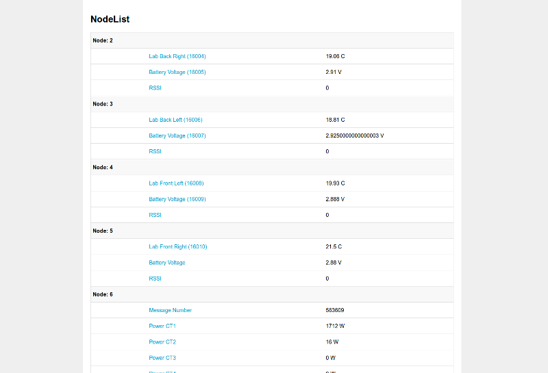

# Emoncms-min

A minimal implementation of an emoncms like web application for energy and environment monitoring writen in python.

- Input stage uses the emonhub serial listener and node decoder written by Jérôme Lafréchoux and Paul Burnell (pb66)

## Installation

Dependencies: python, webpy, redis..

## Setup

- configure emon-py.conf settings.

# Delayed Allocation

                          -> Node UI latest values
                          
SerialListener -> Decoder -> Redis Queue

                             Redis Queue -> Writer -> Disk
                             
Serial data from the rfm12pi is read using the serial listener. The serial data is in byte value form, the byte values get decoded into actual values using the decoder and accompanying decoder.conf file. This first part works in the same way as the listener and decoder part in emonhub. The decoded nodes are displayed in the UI via simple redis link.

Another process or thread called the writer then runs the writing step periodically. The writing step involves first reading all the items out of the redis queue placing the nid.vid values into individual buffers which are again in memory. Then at the end of this process the whole block of data is writen to each data file in one operation.

## Installation

[RaspberryPI Installation](docs/install.md)
