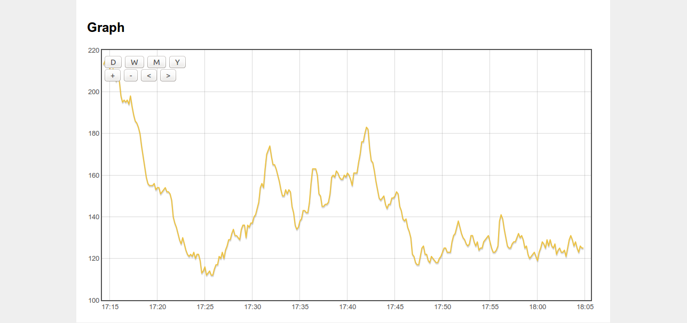

# Emon-py (minimal emoncms)

A minimal implementation of an emoncms like web application for energy and environment monitoring written in python.
Developed to explore the potential for a reduced write load version of emoncms that might allow long term SD card logging.

Node list (configured from text file):

Graphing:

Input stage uses the emonhub serial listener and node decoder written by Jérôme Lafréchoux and Paul Burnell (pb66).

### Installation and setup

[RaspberryPI Installation](docs/install.md)

### System diagram, Delayed Allocation

                             
1. Serial data from the rfm12pi is read using the serial listener. 
2. The serial data is in byte value form, the byte values get decoded into actual values using the decoder. This first part works in the same way as the listener and decoder part in emonhub. 
3. The decoded nodes are displayed via a webpy server UI via simple redis link.
4. Another process called the writer then runs the writing to disk step periodically. The writing step involves first reading all the items out of the redis queue placing the individual node:variable values into individual buffers which are again in memory. Then at the end of this process each block of data accumulated for each node:variable is written to the disk in a single write operation (per node:variable)

### Write performance 

To put the figures below in context the standard emoncms write load on an ext4 partition with a mix of phpfiwa, phpfina and phptimeseries feeds before any of the optimisations implemented here are applied is ~30 kb\_wrtn/s. With a mix of PHPTimestore and MYSQL histograms and daily data the write load was measured as high as 197 kb_wrtn/s. These developments therefore give a significant write rate reduction.

### (vFAT)

    TEST 1 1s COMMIT TIME, 25X 60S FEEDS, 20X 10S FEEDS
    Write load 5 min average: 1.52,1.10,1.19,1.18,1.40,1.70 kb_wrtn/s

    TEST 2 60s COMMIT TIME, 25X 60S FEEDS, 20X 10S FEEDS
    Bytes written every 60 seconds: 788, 456, 604 bytes
    Write load 5 min average: 0.46,0.37,0.46 kb_wrtn/s

    TEST 3 5 minutes COMMIT TIME, 25X 60S FEEDS, 20X 10S FEEDS
    Bytes written every 5 minutes: 2924, 2912, 2692 bytes
    Write load 5 min average: 0.12,0.12,0.12 kb_wrtn/s

    TEST 4 10 minutes COMMIT TIME, 25X 60S FEEDS, 20X 10S FEEDS
    Bytes written every 10 minutes: 5944, 5636, 5860 bytes
    Write load 10 min average: 0.05,0.08,0.06 kb_wrtn/s

    TEST 5 30 minutes COMMIT TIME, 25X 60S FEEDS, 20X 10S FEEDS
    Bytes written every 30 minutes: 17184, 17184 bytes
    Write load 30 min average: 0.03,0.03 kb_wrtn/s

### (Ext4) 

    TEST 1 1s COMMIT TIME, 25X 60S FEEDS, 20X 10S FEEDS
    Write load 5 min average: 5.95,6.07,5.67 kb_wrtn/s

    TEST 2 60s COMMIT TIME, 25X 60S FEEDS, 20X 10S FEEDS
    Bytes written every 60 seconds: 692, 568, 616 bytes
    Write load 5 min average: 3.28,3.17,3.20 kb_wrtn/s

    TEST 3 5 minutes COMMIT TIME, 25X 60S FEEDS, 20X 10S FEEDS
    Bytes written every 5 minutes: 2976, 2916, 2852 bytes
    Write load 5 min average: 0.77,0.79,0.75 kb_wrtn/s

    TEST 4 10 minutes COMMIT TIME, 25X 60S FEEDS, 20X 10S FEEDS
    Bytes written every 10 minutes: 5956, 5700, 5844 bytes
    Write load 10 min average: 0.39,0.09,0.69,0.39 kb_wrtn/s

    TEST 5 30 minutes COMMIT TIME, 25X 60S FEEDS, 20X 10S FEEDS
    Bytes written every 30 minutes: 17396,17460,17084,17276,17564,17240 bytes
    Write load 30 min average: 0.14,0.13,0.12,0.14,0.16 kb_wrtn/s

