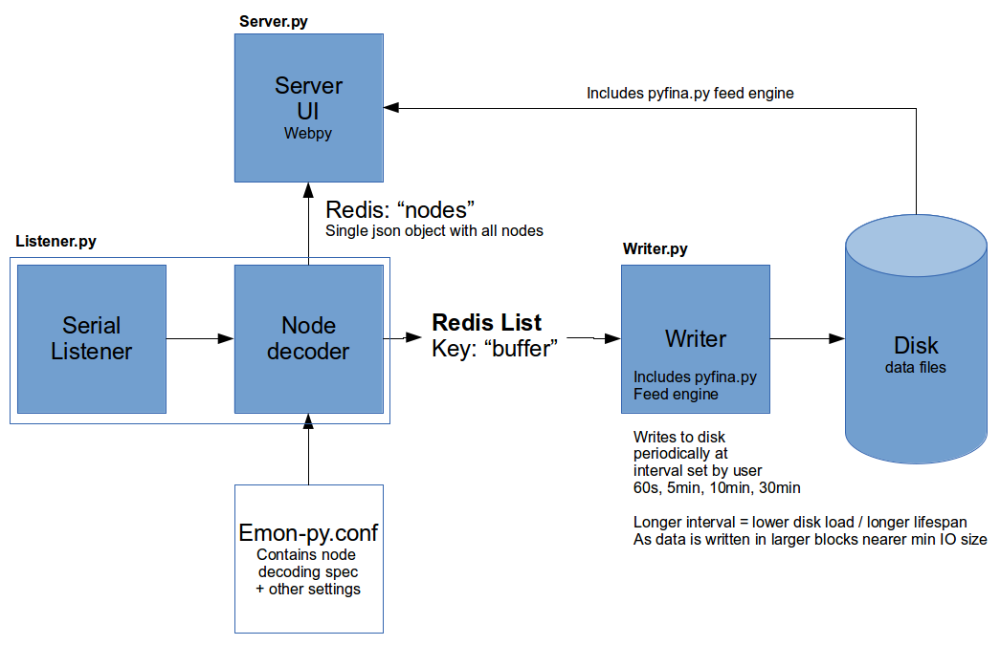

# Emoncms-min

A minimal implementation of an emoncms like web application for energy and environment monitoring written in python.

- Input stage uses the emonhub serial listener and node decoder written by Jérôme Lafréchoux and Paul Burnell (pb66)

## Installation and setup

[RaspberryPI Installation](docs/install.md)

# System diagram, Delayed Allocation

                             
1. Serial data from the rfm12pi is read using the serial listener. 
2. The serial data is in byte value form, the byte values get decoded into actual values using the decoder. This first part works in the same way as the listener and decoder part in emonhub. 
3. The decoded nodes are displayed via a webpy server UI via simple redis link.
4. Another process called the writer then runs the writing to disk step periodically. The writing step involves first reading all the items out of the redis queue placing the individual node:variable values into individual buffers which are again in memory. Then at the end of this process each block of data accumulated for each node:variable is written to the disk in a single write operation (per node:variable)

